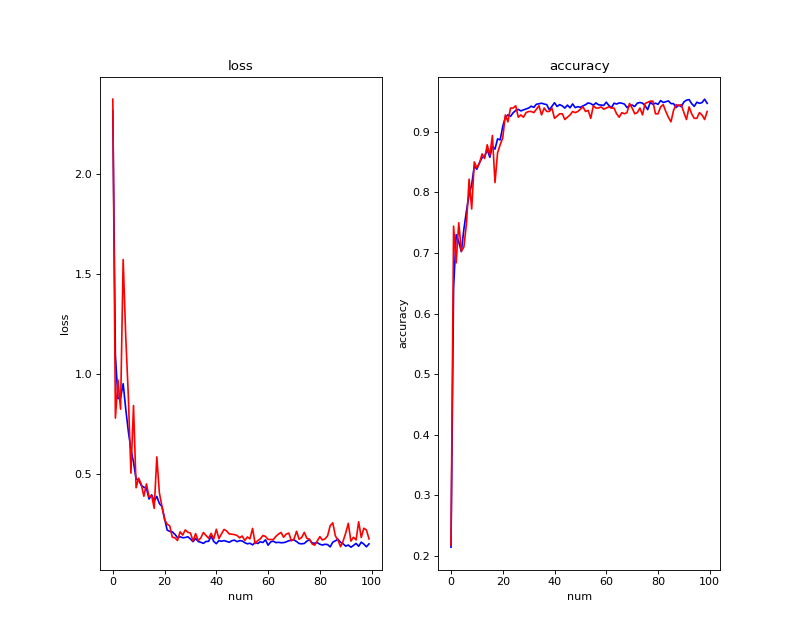

# Plant Seedlings Classification
###### kaggle competition: https://www.kaggle.com/competitions/plant-seedlings-classification/overview
## Introduction
Classification of plant seedlings using `Resnet50` and pytorch. In this case, the FC layer has been changed to class=12.

## Requirements
* pip install easydict==1.8
* pip install pandas
* pip install torch torchvision torchaudio
* pip install numpy
* pip install matplotlib
## Execution
1. python preprocess.py
Divide 20% of the random data in the training data set into the validation data set. After completion, you will see `---Preprocess Finished! ---`prompt on the screen.
3. python train.py
You can adjust model settings through additional parameters on the command line, such as `--bs`, `--lr`, `--wd`, `--factor`, `--warmup_begin_lr`, `--momentum`, `--epochs`, `--warmup_epoch`, `--eval_step`, `--save_step`, `--save_dir`, `--step`.
The training progress information will be displayed on the screen, and the training loss and accuracy of each epoch will be recorded in `acc.txt` at the same time.

And store the training model for every 10 epochs in the checkpoints folder, and name the model with the highest correct rate `model_best.pth`.
3. python submit.py
Use the trained model to test and generate `submission.csv`.
## loss && accuracy
blue = train, red = validation

## Score on Kaggle

